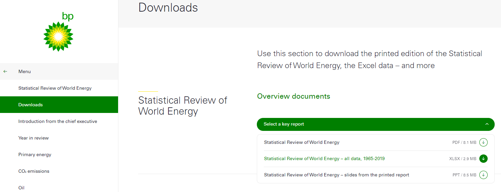

# World Energy Consumption and Generation
Minerva Banuelos, Alison Litton, Charlie Martinez, Matthew Hutcherson, Kristi Mar

## Background

**Data Source**  
https://www.bp.com/en/global/corporate/energy-economics/statistical-review-of-world-energy/downloads.html

**Data Set**

We used "Statistical Review of World Energy - all data, 1965-2019"

## Summary
We know that the Earth’s resources are limited. We will discover what energy sources would look like in the near future. Out of the different energy sources the focus will be the top 2 energy production and consumption sources: Oil and Gas. The premise is to predict the consumption and production of both sources in the next 5 years. 

Data cleaning will be provided through Python Pandas to create/export (ETL)  our new clean csv files. This will allow us to make data driven decisions to investigate our premise of the project. 

A generation with a prediction model for oil and gas energy production and consumption with Scikit-Learn (Machine Learning). We will train and test the prediction model based on historical data to gauge accuracy for future predictions. Tableau will be used to generate the visualizations to illustrate the narrative of the energy sources (oil and gas). To showcase our data analysis we will build a webpage using HTML, CSS, and Bootstrap to present all of our findings.

## Programming Languages and Platforms
* Python - Used to extract, transform and load (ETL) data sets and code machine learning models
	* Libraries
		* Pandas
		* Scikit-learn
* HTML - Used to build basic structure of website employing bootstrap library.
* CSS - Used to format images, title, tables, headers and drop downs.
* Tableau - Used to generate visualizations of data set and machine learning models.  Visualizations are embedded into website.

## Webpage
https://alisonlitton.github.io/world_energy.github.io/index.html

## Additional Resources
[World Population](https://data.worldbank.org/indicator/SP.POP.TOTL?end=2019&start=2010/ "World Population")
[Gross Capital Formation (% of GDP)](https://data.worldbank.org/indicator/NE.GDI.TOTL.ZS/ "GDP %")
[Inflation, Consumer Prices (Annual %)](http://https://data.worldbank.org/indicator/FP.CPI.TOTL.ZG/ "Inflation")
[Taxes on Goods and Services (% of Revenue)](http://https://data.worldbank.org/indicator/GC.TAX.GSRV.RV.ZS?view=chart/ "Taxes on Goods and Services")
[Tableau Visualizations](http://https://public.tableau.com/profile/matthew.hutcherson#!/ "Tableau Visualizations")